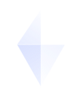

# 🪁 Kite — Mobile App para Mentes Neurodivergentes & Altas Habilidades

<p align="center">
  
</p>

<p align="center">
  <strong>Um espaço seguro, inteligente e acolhedor para pessoas com Altas Habilidades / Superdotação (AH/SD), Dupla Excepcionalidade (2e) e neurodivergências afins.</strong>
</p>

<p align="center">
  
  
  
  
</p>

---

## 🌟 Sobre o Kite

O **Kite** nasceu para suprir uma necessidade urgente: oferecer um refúgio acolhedor onde a intensidade cognitiva, a velocidade de raciocínio, a sensibilidade emocional e as sobre-excitabilidades de pessoas com **Altas Habilidades/Superdotação** e **Dupla Excepcionalidade (2e: Superdotação + TDAH/Autismo)** sejam compreendidas e celebradas, e nunca repreendidas como "excesso".

Visualmente inspirado na identidade gráfica com gradiente violeta e símbolo geométrico da pipa, o app oferece uma experiência mobile responsiva completa, instalável como PWA em smartphones Android e iOS, além de um simulador de smartphone elegante no desktop.

---

## ✨ Funcionalidades Principais

### 1. 🔐 Criação de Conta & Login Acolhedor
* **Tela de Login Autêntica:** Design fiel à identidade visual do Kite (logo origami/pipa, tipografia limpa, gradiente violeta).
* **Onboarding Neurodivergente:** Permite escolher como você se identifica (*Altas Habilidades / Superdotação*, *Dupla Excepcionalidade 2e*, *AuDHD*, *Pesquisador*, *Aliado*).
* **Exploração Rápida (Guest Mode):** Botão para testar o aplicativo instantaneamente sem cadastro prévio.
* **Persistência Local:** Seus dados e preferências ficam salvos no seu próprio navegador via `localStorage`.

### 2. 💬 Comunidade & Chat em Tempo Real
* **Canais Temáticos:**
  * `#comunidade-geral`: Conversas livres sem medo de julgamentos.
  * `#hiperfoco-e-paixoes`: Espaço protegido para compartilhar interesses profundos e projetos de pesquisa.
  * `#dupla-excepcionalidade`: Vivências 2e (Superdotação + TDAH/Autismo/Dislexia).
  * `#sobre-excitabilidade`: Discussões sobre as 5 intensidades de Kazimierz Dąbrowski.
  * `#vida-adulta-e-carreira`: Tédio profissional, impostorismo e burnout.
* **Indicadores de Tom Neurodivergentes (Tone Indicators):** Botões rápidos para sinalizar a intenção da mensagem (`/gen` Genuíno, `/srs` Sério, `/j` Brincadeira, `/info` Compartilhando Fato, `/pos` Positivo, `/vent` Desabafo).
* **Modo Infodump:** Ativa o selo especial de "Infodump Seguro", encorajando textos longos e análises detalhadas sem receio de "falar demais".
* **Reações Interativas:** Interaja com 💡, 🪁, 🧠, ⚡ e ❤️.
* **Respostas Dinâmicas:** A comunidade reage e responde de forma empática quando você envia mensagens.

### 3. 🤖 Kite IA — Assistente Neurodivergente Especializado
* **Base de Conhecimento Científica & Empática:** Especializada na Teoria da Desintegração Positiva (Kazimierz Dąbrowski), desenvolvimento assincrônico (Linda Silverman), modelo dos três anéis (Joseph Renzulli) e identificação tardia em adultos.
* **Chips de Dúvidas Rápidas:**
  * 🧠 As 5 Sobre-excitabilidades de Dabrowski
  * 🧩 O que é Dupla Excepcionalidade (2e)?
  * 🛡️ Burnout e Tédio Crônico em AH/SD
  * 🔍 Identificação em Adultos e Laudos
  * ⚡ Hiperfoco & Dificuldade Executiva
* **Resposta a Qualquer Pergunta:** Digite qualquer dúvida sobre neurodiversidade e receba respostas acolhedoras e estruturadas em tópicos.
* **Leitura por Voz (Text-to-Speech):** Clique em `🔊 Ouvir` para escutar a resposta com síntese de voz nativa.
* **Copiar com 1 Clique:** Compartilhe ou salve as reflexões facilmente.
* **Chave de API Opcional:** Suporte a chave Gemini/OpenAI para quem desejar integrar modelos externos.

### 4. 🧘 Foco & Sentidos (Ferramentas de Regulação)
* **Temporizador de Hiperfoco:** Modos 25m Clássico, 50m Hiperfoco Profundo e Contagem Livre (sem ansiedade de relógio).
* **Paisagens Sonoras Sintetizadas (Web Audio API):** Áudios suaves gerados matematicamente no próprio navegador (🌧️ Chuva Suave, 🕊️ Ruído Rosa Relaxante, 🧠 Frequência Gama 40Hz para foco analítico) — *sem necessidade de arquivos de áudio externos!*
* **Respiração Guiada da Pipa (4-7-8):** Pipa animada que expande e contrai para desacelerar o sistema nervoso autônomo em momentos de sobrecarga sensorial ou ansiedade.

### 5. 👤 Perfil & Ajustes Sensoriais
* **Modo Baixo Estímulo Sensorial (Sensory Friendly):** Suaviza contrastes e diminui estímulos visuais para momentos de fadiga sensorial.
* **Alternador de Temas:** Violeta Kite Original, Verde Sálvia Calmante ou Veludo Noturno Escuro.
* **Simulador Desktop / Mobile:** Alterne facilmente entre o visual em moldura de smartphone ou modo tela cheia no computador.

---

## 📁 Estrutura do Projeto

```text
kite/
│
├── assets/
│   └── kite-logo.svg       # Vetor SVG oficial da Pipa Geométrica Kite
│
├── css/
│   ├── variables.css       # Tokens, paletas neuroinclusivas e fontes
│   ├── base.css            # Reset, moldura do smartphone e responsividade
│   ├── auth.css            # Estilos de login e cadastro (fiel à imagem)
│   ├── chat.css            # Chat, canais, tone tags e reações
│   ├── ai.css              # Interface da Kite IA e balões de diálogo
│   ├── tools.css           # Timer de foco, áudio e respiração 4-7-8
│   └── components.css      # Navegação inferior, feed e perfil
│
├── js/
│   ├── state.js            # Gerenciador de estado reativo & localStorage
│   ├── auth.js             # Lógica de login, cadastro, tags e convidados
│   ├── chat.js             # Canais comunitários, infodump e respostas
│   ├── ai.js               # Motor neural especialista da Kite IA & TTS
│   ├── tools.js            # Temporizador, sintetizador de som e respiração
│   └── app.js              # Inicializador, roteador de abas e toasts
│
├── index.html              # Ponto de entrada do app
├── manifest.json           # Manifesto PWA para instalação no celular
├── sw.js                   # Service Worker para funcionamento offline
├── package.json            # Metadados do projeto
├── LICENSE                 # Licença MIT aberta
└── README.md               # Esta documentação completa
```

---

## 🚀 Como Executar Localmente

Como o Kite foi construído em arquitetura web moderna e modular sem dependências obrigatórias de compilação:

1. **Opção 1 (Direto pelo navegador):**
   * Basta dar dois cliques no arquivo `index.html`. Ele abrirá diretamente no Google Chrome, Edge, Safari, Firefox ou Opera!

2. **Opção 2 (Com servidor local):**
   * Se tiver a extensão **Live Server** no VS Code: clique com o botão direito no `index.html` e selecione *Open with Live Server*.
   * Ou pelo terminal: `npx serve .`

---

## 📤 Como Adicionar este Projeto ao GitHub (Passo a Passo)

Você pode enviar este projeto para o seu GitHub de **3 formas fáceis**:

### 🔹 Método 1: Pelo Terminal / Linha de Comando (Recomendado)

1. Crie um novo repositório vazio no [GitHub](https://github.com/new) com o nome `kite-app`.
2. Abra o terminal (PowerShell ou Prompt de Comando) dentro desta pasta do projeto.
3. Execute a sequência de comandos abaixo:

```bash
# 1. Inicializar o repositório Git local
git init

# 2. Adicionar todos os arquivos ao versionamento
git add .

# 3. Criar o primeiro commit
git commit -m "feat: initial commit of Kite mobile app for neurodivergent and gifted people"

# 4. Definir a branch principal como main
git branch -M main

# 5. Conectar com o seu repositório no GitHub (substitua SEU-USUARIO pelo seu username)
git remote add origin https://github.com/SEU-USUARIO/kite-app.git

# 6. Enviar para o GitHub
git push -u origin main
```

---

### 🔹 Método 2: Usando o GitHub Desktop (Visual e Simples)

1. Baixe e instale o [GitHub Desktop](https://desktop.github.com/) caso ainda não o tenha.
2. Abra o GitHub Desktop e clique em **File > Add Local Repository...** (ou pressione `Ctrl + O`).
3. Selecione a pasta onde estão os arquivos do Kite.
4. O GitHub Desktop mostrará a opção *"Create a repository here"*. Clique nela.
5. Clique em **Publish repository** no topo para enviar diretamente para a sua conta do GitHub!

---

### 🔹 Método 3: Pelo Navegador (Sem instalar nada!)

1. Acesse o [GitHub](https://github.com/new) e crie um novo repositório com o nome `kite-app`.
2. Na página inicial do repositório recém-criado, clique no link **"uploading an existing file"** (carregar arquivos existentes).
3. Selecione ou arraste todos os arquivos e pastas deste projeto para a página:
   * `index.html`
   * `manifest.json`
   * `sw.js`
   * `package.json`
   * `LICENSE`
   * `README.md`
   * Pastas `assets/`, `css/` e `js/`
4. Digite uma mensagem de commit (ex: *"Primeira versão do Kite"*) e clique em **Commit changes**.

---

## 🌐 Publicando o App Online Gratuitamente (GitHub Pages)

Depois de enviar o repositório para o GitHub, você pode transformá-lo em um aplicativo acessível no celular de qualquer pessoa:

1. No seu repositório no GitHub, clique na aba **Settings** (Configurações).
2. No menu lateral esquerdo, clique em **Pages**.
3. Na seção *Build and deployment > Branch*, selecione a branch `main` e a pasta `/(root)`.
4. Clique em **Save**.
5. Em cerca de 1 minuto, o GitHub gerará um link público seguro (ex: `https://seu-usuario.github.io/kite-app/`).
6. Abra esse link no seu celular (Safari no iPhone ou Chrome no Android) e selecione **"Adicionar à Tela de Início"** para ter o Kite instalado como um app nativo!

---

## 📄 Licença

Este projeto é disponibilizado sob a licença [MIT](LICENSE). Sinta-se livre para usar, estudar, aprimorar e compartilhar! 🪁💜
